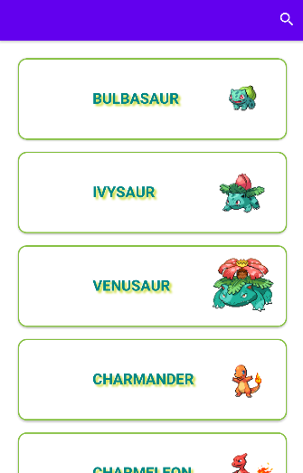

<h1 align="center">Pokedex API</h1>
 
<h3 align="center">Api created in Android Studio using Kotlin that brings data from https://pokeapi.co/</h3>
 
<b>Updated</b> version of https://github.com/ricardobar96/pokedex-api-old, developed by me and Enrique. I modified the Api to return only <b>the first 151 pokemon</b> (first generation), cleared the layout to display only <b>one pokemon per row</b> and changed its <b>visual appearance</b>, bringing new functionalities in the form of <b>menu items</b> and the possibility to access to a <b>specific pokemon</b> view by clicking on it. Enrique contributed by migrating the app to <b>Kotlin</b>,  changing with me <b>the appearance</b> (such as implementing the <b>CardView</b>) and <b>cleaning</b> the code while keeping all functionalities.

 
 

## Features

- API consumption.
- Recycler View display.
- Display API text.
- Display API Images.

 
 
 
 

